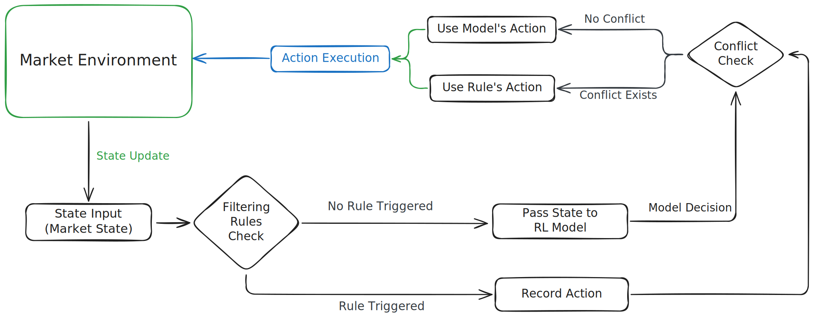

# Deep Reinforcement Learning Trading Agent

This project implements a Deep Reinforcement Learning (DRL) agent for trading financial assets using historical market data. The agent is trained using the Deep Q-Learning (DQN) algorithm and supports both training and testing modes.



## Features

- **Deep Q-Learning Implementation**: 
  - Supports epsilon-greedy exploration.
  - Uses experience replay and target networks for stable learning.
- **Customizable Environment**: 
  - Simulates trading scenarios with historical market data.
  - Supports multiple technical indicators like Bollinger Bands and Moving Averages.
- **Data Normalization**: 
  - Static and rolling normalization methods.
  - Automatic method selection based on data characteristics.
- **Technical Indicators**: 
  - Automatic parameter selection for Moving Averages, Bollinger Bands, RSI, and more.
- **Visualization**: 
  - Plots trading behavior and model losses.


## Installation

1. Clone the repository:
   ```bash
   git clone https://github.com/your-repo/drl-trading.git
   cd drl-trading
   ```

2. Install dependencies:
   ```bash
   pip install -r requirements.txt
   ```

3. Ensure you have the dataset in the `datasets/` directory. The default dataset is `datasets/AAPL_2009-2010_6m_raw_1d.csv`.


## Usage

### Command-Line Arguments

The main script (`main.py`) uses command-line arguments to configure the training and testing process. Below is a list of supported arguments:

| Argument            | Default Value                          | Description                              |
| --------            | -------------                          | -----------                              |
| `--data_path`       | `datasets/AAPL_2009-2010_6m_raw_1d.csv`| Path to the dataset.                     |
| `--backtest_data`   | `datasets/GOOG_2009-2010_6m_raw_1d.csv`| Path to the backtestdataset.             |
| `--cv`              | `True`                                 | Whether to use cross validation.         |
| `--n_folds`         | `5`                                    | Number of folds for cross validation.    |
| `--train_split`     | `0.8`                                  | Train/test split ratio.                  |
| `--n_episodes`      | `3`                                    | Number of training episodes.             |
| `--window`          | `1`                                    | Window size for averaging scores.        |
| `--window_size`     | `1`                                    | Observation window size.                 |
| `--epsilon`         | `1.0`                                  | Initial epsilon for exploration.         |
| `--eps_min`         | `0.01`                                 | Minimum epsilon value.                   |
| `--eps_decay`       | `0.995`                                | Epsilon decay rate.                      |
| `--buffer_size`     | `1000`                                 | Replay buffer size.                      |
| `--batch_size`      | `32`                                   | Training batch size.                     |
| `--gamma`           | `0.95`                                 | Discount factor.                         |
| `--alpha`           | `1e-3`                                 | Soft update parameter.                   |
| `--lr`              | `0.001`                                | Learning rate.                           |
| `--update_step`     | `4`                                    | Steps between network updates.           |
| `--seed`            | `42`                                   | Random seed.                             |
| `--verbose`         | `False`                                | Enable verbose output.                   |
| `--model_path`      | `checkpoint.pth`                       | Path to save/load the model.             |
| `--mode`            | `both`                                 | Run mode: `train`, `backtest`.           |

### Example Commands

#### Train and Test
```bash
python main.py
```

#### Cross Validation
```bash
python main.py --cv --n_folds 5
```

#### Backtest Only
```bash
python main.py --mode backtest \
--model_path checkpoints/checkpoint.pth \
--backtest_data datasets/GOOG_2009-2010_6m_raw_1d.csv
```


## Project Structure

```
drl-trading/
├── datasets/                   
│   ├── GOOG_2009-2010_6m_raw_1d.csv      # Directory for backtesting
│   └── AAPL_2009-2010_6m_raw_1d.csv      # Directory for training and testing datasets
├── src/                                  # Source code directory
│   ├── agent.py                          # DQN agent implementation
│   ├── environment.py                    # Trading environment
│   ├── features.py                       # Technical indicators computation
│   ├── model.py                          # Neural network model for DQN
│   ├── preprocess.py                     # Data preprocessing utilities
│   ├── normalize.py                      # Data normalization utilities
│   ├── replay_buffer.py                  # Experience replay buffer
│   └── plots.py                          # Plotting utilities
├── checkpoints/                          # Directory for saving model checkpoints
│   └── checkpoint.pth                    # Checkpoint file
├── results/                              # Directory for backtesting results
│   └── results.csv                       # Results file
├── main.py                               # Main script for training and testing
├── requirements.txt                      # Python dependencies
└── README.md                             # Project documentation
```


## Development

### Add New Features
1. Extend the `src/` directory with new modules.
2. Update `main.py` to integrate new features or arguments.
3. Add test cases to ensure functionality.

### Testing
Run the scripts in `src/` individually to test specific components. For example:
```bash
python -m src.environment
```

## Contributions
Contributions are welcome! Please fork the repository and submit a pull request with detailed explanations of your changes.


## License
This project is licensed under the MIT License. See the `LICENSE` file for details.