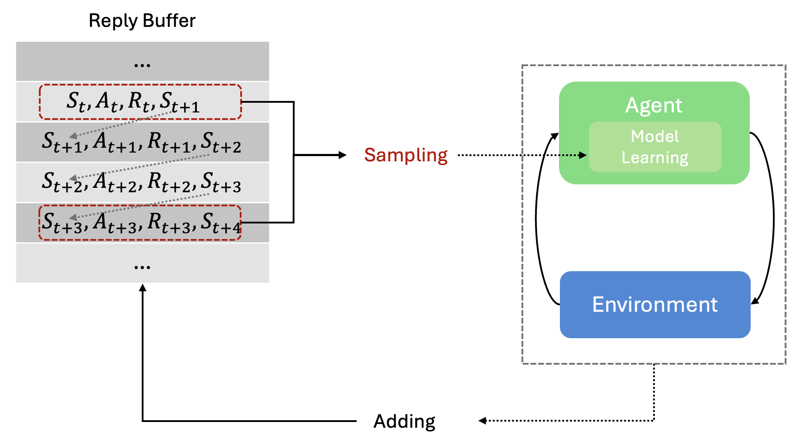

# Reinforcement Learning-Based Trading System

## **System Workflow**

1. **State Input**:  
   - The market state is fed into the system.

2. **Filtering Rules Check**:  
   - If a filtering rule (e.g., stop-loss or take-profit) is triggered, the corresponding action (e.g., "sell") is recorded.  
   - The updated state and the triggered action are then passed to the model.

3. **Model Decision**:  
   - The model makes a decision based on the updated state.  
   - If the model’s action conflicts with the action triggered by the filtering rule, the filtering rule's action takes priority.

4. **Action Execution**:  
   - The final action (either the rule-triggered action or the model’s action) is executed.

5. **State Update**:  
   - The market state is updated, and the system proceeds to the next decision-making cycle.

## **Key RL Components**

1. **State Definition**:
   - Market data features (price, volume, technical indicators)
   - Recent trading history
   - Market technical indicators

2. **Action Space**:
   - Discrete actions: Buy, Sell, Hold

3. **Reward Structure**:
   - **Buy Actions**: $R_{buy} = 0$ (default)
   - **Hold Actions**: $R_{hold} = 0$ (default)
   - **Sell Actions**: $R_{sell} = log(P_{sell} / P_{buy})$

> For detailed implementation guidelines and mathematical formulations, please refer to the [technical documentation](./dev/report.md).

4. **Experience Replay**:
   - Fixed-size buffer storing (s, a, r, s', done) tuples
   - Random batch sampling (batch_size=64)
   - Breaks correlations and enables efficient learning

5. **DQN**:
   - Architecture: Input → [64, 32, 8] ReLU → 3 Linear
   - Training: MSE Loss, Adam(lr=5e-4)
   - Double DQN with soft target updates (α=1e-3)

6. **Agent**:
   - Networks: Local (action) + Target (estimation) + Replay Buffer
   - Features: ε-greedy exploration, periodic updates (4 steps)
   - Parameters: γ=0.99, lr=5e-4, α=1e-3
   - Modes: Training (exploration) / Testing (deterministic)

> For detailed implementation guidelines and mathematical formulations, please refer to the [illustraed DQN notebook](https://github.com/deepbiolab/drl/blob/main/model-based-learning/value-based/vanilla-dqn/dqn_lunarlander.ipynb).

